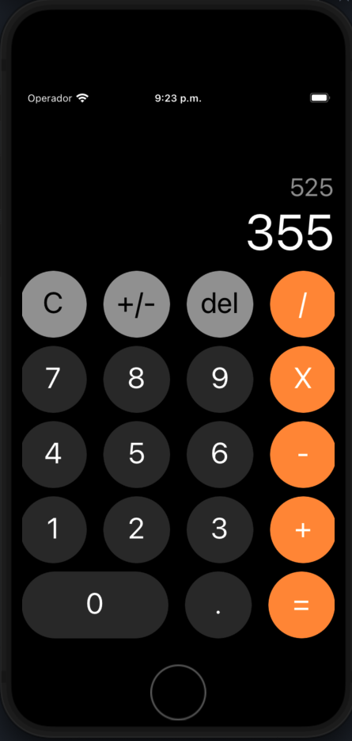

<h1 align='center'>iOS Calculator Clone 📱</h1>

## Overview 📘
iOS calculator app clone for practicing React Native while I'm learning the technologie.

## Screenshot 📷


## Features 🕹️
- All the basic operations of a calculator

## Technologies 💻
- React Native
- Typescript

## How to use ⚙️
- Run the following commands after cloning the project
```
npm install
npx pod-install ios
```
- The next step is run the following command to run the app on your terminal
- Make sure you have all the necessary environment setup required for running an Android or iOS simulator
```bash
npm run ios

# you can run the app on android just replacing ios word for android  word
```
